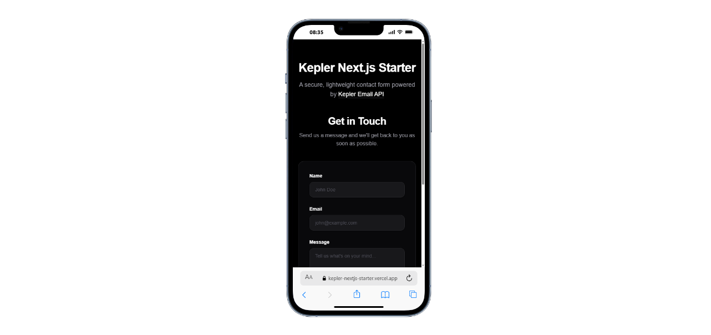

# Kepler Next.js Contact Form Starter

> **The fastest production-ready contact form for Next.js.**
> Copy → paste → add API key → done.

[](https://nextjs.org/)
[](https://www.typescriptlang.org/)
[](https://tailwindcss.com/)
[](https://vercel.com/new/clone?repository-url=https://github.com/JOSEPH-Inalegwu/kepler-nextjs-starter&env=KEPLER_API_KEY,CONTACT_EMAIL,DISCORD_WEBHOOK_URL)

**No packages. No backend setup. Spam-protected by default.**
Works with Next.js App Router (Server Actions). Built for developers who want full control, security, and speed.

👉 [**View Live Demo ↗**](https://kepler-nextjs-starter.vercel.app)
👉 **Powered by:** [Keplers Email API](https://keplers.email)



---

## ⚡ Get a Working Contact Form in 3 Steps

**⏱️ Setup time: ~2 minutes**

### 1️⃣ Create a Keplers account
Create a free account on [Keplers](https://keplers.email) and generate your **API Key**.

### 2️⃣ Add your environment variables
Create a `.env.local` file in your project root:

```bash
# Kepler Email API Configuration
KEPLER_API_KEY=sk_your_kepler_api_key_here
CONTACT_EMAIL=your-email@example.com

# Optional: Discord/Slack Webhook (for instant notifications)
DISCORD_WEBHOOK_URL=https://discord.com/api/webhooks/your-webhook-url

```

> 🔒 **Security Note:** API keys are never exposed to the client (handled via Server Actions).

### 3️⃣ Copy the files & Ship

Copy these files from the starter into your project:

* **The Logic:** `types/index.ts`, `lib/kepler.ts`, `app/actions.ts`
* **The UI:** `components/kepler/` (contact-form, submit-button, toast)

Then, import and use it in your page:

```tsx
import { ContactForm } from "@/components/kepler/contact-form";

export default function ContactPage() {
  return (
    <div className="flex min-h-screen items-center justify-center">
      <ContactForm />
    </div>
  );
}

```

**That’s it.**
Submit the form → email delivered → optional Discord notification fired.

---

## 🧠 Philosophy (Why this exists)

**This is not an npm package.** It's a collection of copy-pasteable files designed to give you full control over styling, validation, and logic—similar to [Shadcn UI](https://ui.shadcn.com/).

Instead of installing a black-box dependency, you copy the files you need into your project and customize them to fit your exact requirements. No bloat, no magic, just clean, readable code you own.

## 🎯 Who This Is For

This starter is for you if:

- You want the fastest possible contact form in Next.js
- You don’t want to install heavy form libraries
- You care about server-side security
- You want spam protection without CAPTCHA
- You want to own and customize the code

---

## ✨ Features

* **🛡️ Smart Spam Protection** - Uses a "Honeypot" strategy (`_gotcha` field) to block bots without annoying CAPTCHAs
* **🔔 Webhook Notifications** - Optional support for Discord/Slack webhooks—get pinged instantly when a lead comes in
* **⚡ Instant Delivery** - Uses Keplers' priority endpoint for immediate email sending
* **🍞 Zero-Dependency Toast** - Custom, lightweight toast notifications (no external libraries)
* **🔒 Server-Side Security** - API keys never exposed to the client (uses Next.js Server Actions)
* **📦 Zero-Dependency Validation** - No Zod, no React Hook Form—just clean, native validation
* **📘 Fully Typed** - Complete TypeScript support for type safety
* **🎨 Customizable** - Own the code, modify styles and logic as needed

---

## 📁 Project Structure

```
kepler-starter/
├── app/
│   ├── actions.ts          # Server Actions - handles form submission
│   ├── page.tsx            # Main page with contact form
│   ├── layout.tsx          # Root layout
│   └── globals.css         # Global styles
├── components/
│   └── kepler/             # Kepler UI components
│       ├── contact-form.tsx    # Main contact form component
│       ├── submit-button.tsx   # Form submit button with loading state
│       └── index.ts            # Barrel exports
├── lib/
│   └── kepler.ts           # Kepler API client wrapper
├── types/
│   └── index.ts            # TypeScript type definitions
├── .env.local              # Environment variables (not committed)
├── package.json
└── README.md

```

### 🏗️ Architecture Overview

* **🌉 The Bridge** (`app/actions.ts`)
Next.js Server Actions that securely handle form submissions. This is where your API key lives, safely on the server.
* **🎨 The UI Library** (`components/kepler/`)
Reusable React components styled with Tailwind CSS. These components are framework-agnostic and can be easily copied to other projects.
* **🔌 The SDK** (`lib/kepler.ts`)
A lightweight wrapper around the Keplers Email API. Handles all HTTP communication with proper error handling.
* **📜 The Contract** (`types/index.ts`)
TypeScript interfaces and types that define the shape of your data. Ensures type safety across your application.

---

## 🛠️ Built With

* [Next.js 15](https://nextjs.org/) - React framework with Server Actions
* [TypeScript](https://www.typescriptlang.org/) - Type safety
* [Tailwind CSS 4](https://tailwindcss.com/) - Utility-first CSS framework
* [Keplers Email API](https://keplers.email) - Email delivery service

---

## 📝 License

This project is open source and available under the [MIT License](https://www.google.com/search?q=LICENSE).

---

## 🤝 Contributing

Contributions, issues, and feature requests are welcome! Feel free to check the [issues page](https://github.com/JOSEPH-Inalegwu/kepler-nextjs-starter/issues).

---

## 💡 Need Help?

- [Keplers Documentation](https://docs.keplers.email)
- [Next.js Server Actions](https://nextjs.org/docs/app/building-your-application/data-fetching/server-actions-and-mutations)
- [Tailwind CSS Docs](https://tailwindcss.com/docs)

---

<div align="center">

**Made with ❤️ by [Joseph Inalegwu](https://github.com/JOSEPH-Inalegwu) for developers who value security and simplicity.**

<a href="https://github.com/JOSEPH-Inalegwu/kepler-nextjs-starter/stargazers">

</a>

</div>

